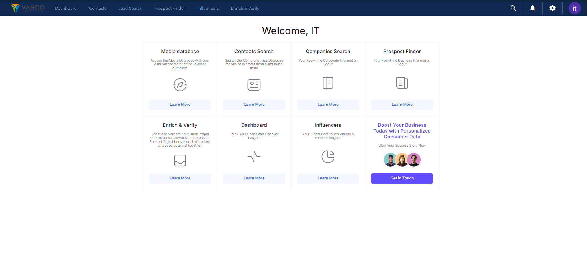
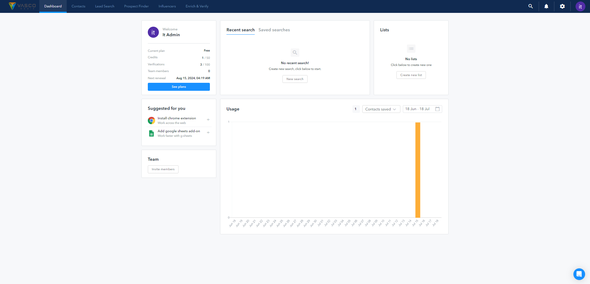
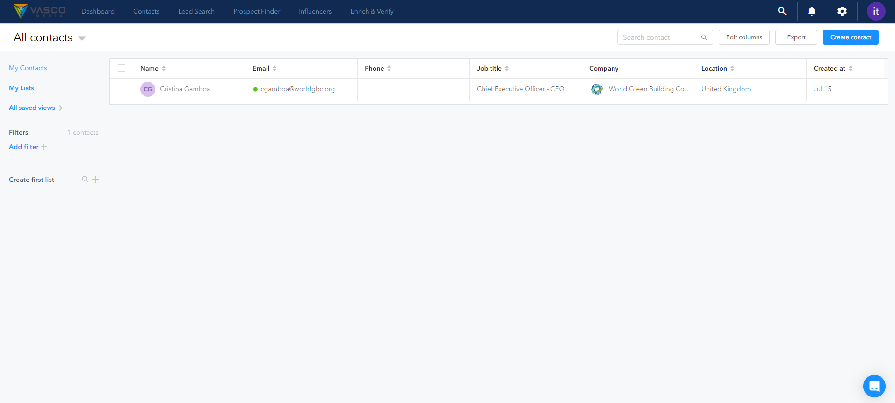
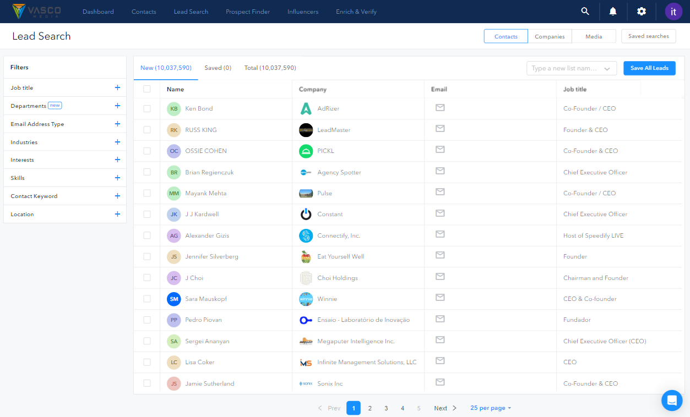
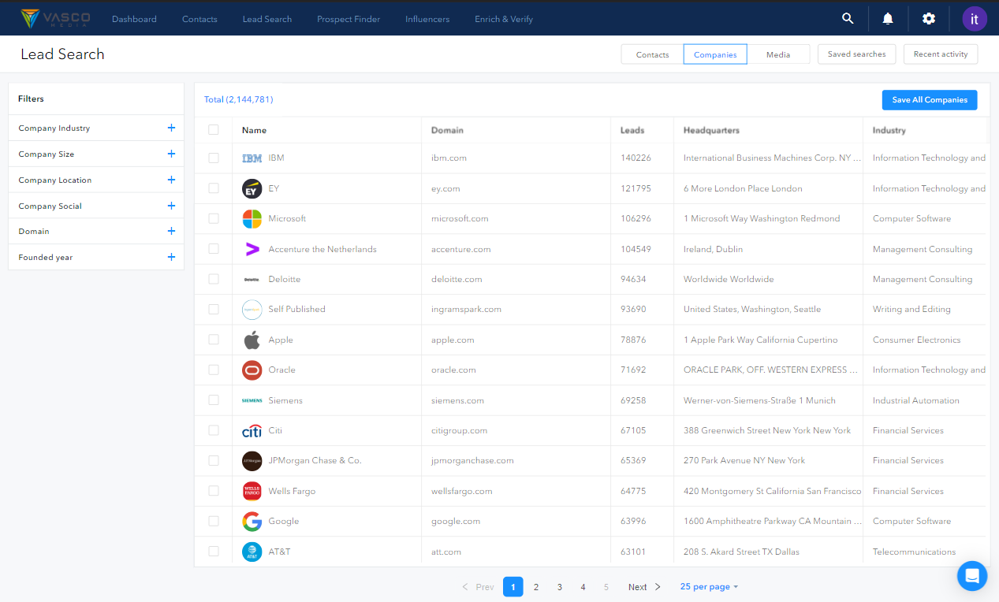
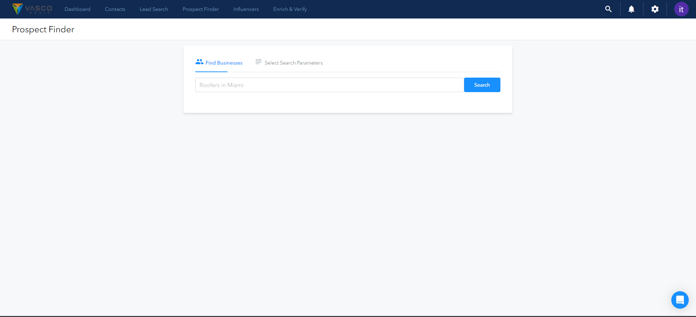

# Web App Overview

This document gives an overview of our Web App and its various pages. The pages are designed to provide a user-friendly interface, and each page serves a specific purpose.

## Navbar Pages

### 1. Home Page
Clicking on the logo brings you back to the home page, the central hub of the site.

### 2. Dashboard
The Dashboard displays usage statistics, giving insights into app performance.

### 3. Contacts
This page stores all user's saved data, including 'My Contacts' and 'My Lists'. Data can be added by unlocking it from the Lead Search & Prospect Finder sections.

### 4. Lead Search
This feature allows the user to search for specific contacts or companies using specific filters, such as job title or company size.

- **Contact Search**: This involves searching through our database using specific filters such as job title or job title level.

- **Companies Search**: This allows users to search for specific companies using filters like the year the company was founded, their website, company size, LinkedIn URL, or the company's name.

- **Media & PR**: This function queries either our main database or a smaller dedicated database.

### 5. Prospect Finder
This feature uses multiple APIs to find and display data. 

- **G-Maps API**: This third-party API fetches geolocation data. In conjunction with this, the Website-Scraper API is used to extract data from the identified websites.

- **Search Parameters** Include:
  - Latitude & Longitude for G-Maps API
  - Email Address Verification (API)
  - LinkedIn Verification (API)
  - Phone Number Validation (API)
  - TCP Litigator Check
  - SEO Analysis

### 6. Influencers
This section uses the Podcast API to fetch data related to influencers. There is ongoing work to develop another API for this section.

### 7. Enrich & Verify
This is the section to upload your CSV file to verify or enrich data, or to push a list for verification. It supports:

- Email Address Verification (API)
- LinkedIn Verification (API)
- Phone Number Validation (API)
- TCP Litigator Check
- SEO Analysis (API)
